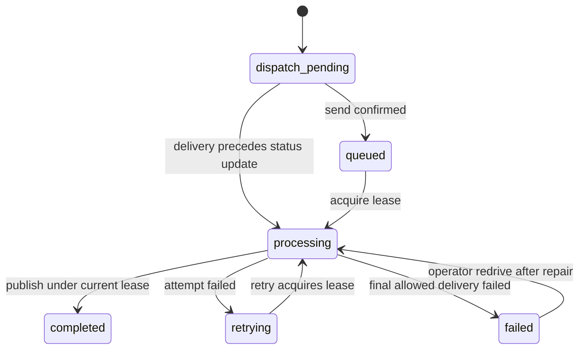

# Durable submissions and caller access

This release changes the API contract and queue message format. Deploy it as a
coordinated migration after draining the previous worker queue and DLQ.

## Authentication and ownership

Both routes require an AWS Signature Version 4 signed request and the existing
`x-api-key`. Give each approved IAM user or role the policy returned by
`terraform output -raw client_invoke_policy`. API keys are usage controls; they
are not the caller identity.

The handlers derive ownership from API Gateway's trusted
`requestContext.identity.userArn` and `identity.caller`. Request-body identity
fields and identity headers have no authority. All sessions of one IAM role share
ownership. Separate customers must use separate roles or users. Recreating a role
changes its principal ID and does not silently inherit the old role's submissions.
Root and federated-user principals are not supported; assume a dedicated role.
Only administrators should have direct Lambda invocation or write access to the
backing table, bucket, or queues. Those privileges bypass the public API boundary.

`GET /submissions/{submissionId}` returns 404 for unknown, foreign, and ownerless
records. Its response omits owner identifiers, storage locations, request hashes,
lease tokens, and internal exception messages. Existing ownerless submissions are
not automatically assigned to the first person requesting them.

## Idempotent intake

Send an `Idempotency-Key` header containing 8-128 letters, numbers, dots,
underscores, colons, or hyphens. Generate a new key for each logical submission.
Retry ambiguous HTTP failures with the same key and payload.

- The key is scoped to the authenticated principal.
- Matching retries return the same submission ID and current status.
- A different normalized payload under the same key returns 409.
- JSON metadata key order does not change the fingerprint.
- Completed replays return 200; accepted unfinished submissions return 202.
- A 202 response can contain `dispatch_pending`: data is durable and waiting for
  automatic dispatch recovery. It does not claim that SQS has accepted a message.
- Keys remain reserved for as long as their DynamoDB submission record exists.
  A future deletion policy must explicitly define the resulting replay window.

Intake writes immutable, content-addressed image and submission objects before
conditionally creating the DynamoDB record. Concurrent requests cannot overwrite
each other's data. Failed or losing requests can leave unreferenced S3 objects;
the submission/upload lifecycle rules clean them up. An interrupted upload or
failed DynamoDB creation returns 503 and must be retried by the client.

The DynamoDB record starts at `dispatch_pending`. Dispatch sends only
`{"submissionId":"..."}` to SQS and conditionally changes the record to `queued`.
If sending fails, or sending succeeds but its response/status update is lost,
the scheduled reconciler retries. It queries the pending-status index every
minute, checks the current record with a consistent read, and processes bounded
pages. A worker that has already started or completed cannot be reset to queued.
Continuing reconciliation failures trigger the dispatch Lambda error alarm;
configure `alarm_action_arns` to route alarms.

## Worker state and leases



Each worker atomically claims a 90-second lease with a unique token. The deployed
worker timeout is 60 seconds and SQS visibility is 360 seconds. An expired lease
can be reclaimed after a crashed or timed-out worker; an active lease causes a
duplicate delivery to be retried. Completed jobs are acknowledged without
reprocessing.

Result objects use `results/{submissionId}/{leaseToken}.json`. A conditional
DynamoDB update publishes the authoritative pointer only while that token still
owns an unexpired lease. A late worker can leave an unreferenced attempt object,
but cannot replace a newer result or revert completed state. Success clears the
last public failure code. Queue-supplied bucket, table, image, and result paths
are ignored; the worker uses configured resources and the durable record.

The event mapping enables `ReportBatchItemFailures` and uses one message per
invocation. Failed records remain retryable and the source queue moves them to its
DLQ after the configured receive limit. Ordinary caught failures set `retrying`,
then `failed` on the final delivery. A hard process timeout may leave `processing`
with an expired lease even after DLQ arrival: operators must inspect both the DLQ
and record before recovery. `failed` is an operational outcome, not a document
screening decision. After repair, redrive through SQS; do not edit completed
records to force reprocessing. A deliberate new screening run uses a new key.

## Migration and rollback

1. Use a disposable stack to run the verification below before serving real data.
2. Pause submissions to an existing stack. Drain the old queue and handle its DLQ
   using the old worker; legacy envelopes and ownerless records are intentionally
   rejected by the new worker.
3. Preserve a snapshot and audit mapping of legacy records. Keep any historical
   access in a separately authorized administrative workflow. Do not expose old
   records through a public owner-claim endpoint.
4. Grant each client the generated invoke policy and update it to sign requests
   and persist idempotency keys. Keep the API key for usage limits.
5. Apply the complete Terraform change and application package together. The API
   deployment trigger includes authorization and integration configuration, so
   existing stages adopt the new IAM requirement. Node.js 22 matches CI.
6. Verify an owned submission, foreign-owner denial, duplicate replay, recovery,
   and alarm routing before resuming traffic.

On regression, stop accepting new work and disable the worker event mapping while
investigating. Prefer a forward fix. Reverting to the old unsigned API exposes
records without ownership checks; the old worker cannot consume the new minimal
queue messages. Do not roll it back onto the new queue or relax authorization to
restore traffic. Retain the new records and objects until a compatible recovery
or migration is ready.

## Local and infrastructure validation

```bash
cd lambda_function
npm ci
npm test
npm run smoke
cd ../terraform
terraform init -backend=false
terraform fmt -check -recursive
terraform validate
terraform test
```

The application tests exercise real DynamoDB expressions through Dynalite with
mock S3/SQS transports. They cover concurrent intake, conflicts, enqueue failures,
ambiguous responses, lease contention, stale workers, ownership, and partial
batches. The smoke path uses the same emulator. Terraform tests mock providers and
assert IAM path coverage, authenticated routes, scheduled dispatch, runtimes, and
lease/queue settings. These tests do not prove deployed AWS IAM or actual DLQ
behavior. Terraform tests require Terraform 1.7 or newer.

## Live AWS verification

Use an isolated stack with unique resource names and `tags.environment` set to
`verification`, `test`, or `dev`. Never run the failure exercise against a queue
serving real traffic. The verification creates a real synthetic PNG, uses supplied
synthetic OCR text, and checks deployed intake/worker image permissions. It does
not evaluate OCR accuracy or document authenticity.

Prepare two distinct IAM client profiles and attach `client_invoke_policy` to
both. The primary verification profile also needs access to this stack's API key
(`apigateway:GET` for that key), S3 test-object reads, DynamoDB GetItem/PutItem, and
SQS SendMessage/ReceiveMessage/DeleteMessage/ChangeMessageVisibility for the
specific test queues. Do not grant those administrative permissions to ordinary
service consumers.

```bash
terraform -chdir=terraform output -json > /tmp/license-verification-outputs.json
cd lambda_function
npm ci
AWS_PROFILE=verification-primary npm run verify:aws -- \
  --outputs /tmp/license-verification-outputs.json \
  --expected-bucket YOUR-DISPOSABLE-BUCKET \
  --other-profile verification-secondary \
  --allow-failure-test
```

The script reads the API key into memory and never prints credentials. It checks
unsigned denial, signed image upload, same-key replay, different-payload conflict,
and a second caller's 404 response. It then creates a unique synthetic record
referencing a missing object, enqueues it, and waits for at least five recorded
worker attempts and actual DLQ arrival. With 360-second visibility, allow roughly
30 minutes for retry exhaustion; the default deadline is 40 minutes. It removes
only its matched DLQ message and leaves unrelated messages available.

After validation, inspect any failures by the printed synthetic submission ID.
Remove the disposable stack's synthetic objects, **including noncurrent versions
and delete markers**, then run `terraform destroy` for that isolated stack.
Terraform intentionally does not force-delete the bucket. Do not reuse cleanup
commands against an existing service bucket. The harness leaves test records and
objects for inspection and does not automatically destroy infrastructure.
